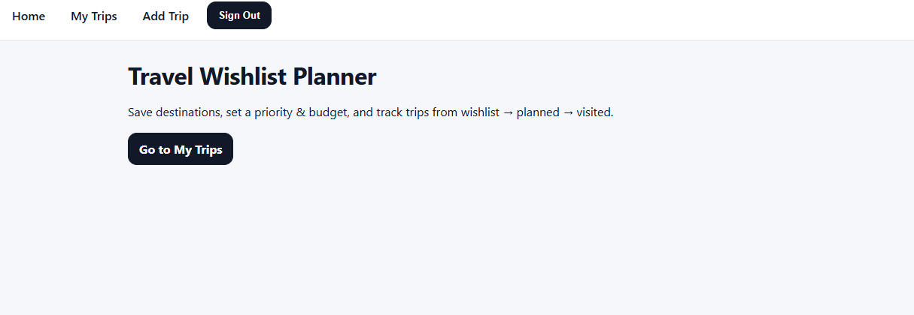
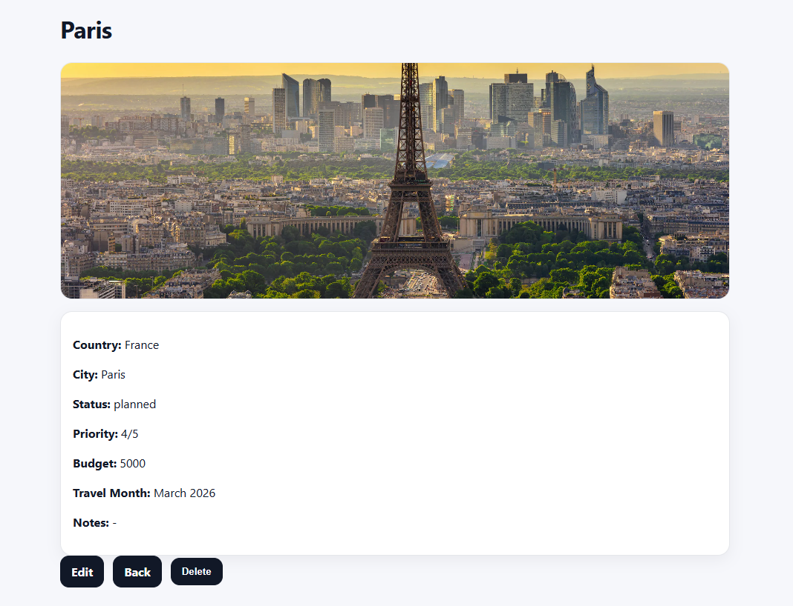

# Travel Wishlist Planner ✈️🌍

Travel Wishlist Planner is a full-stack CRUD app that allows users to create an account and manage a personal list of travel destinations. Users can save trips, set priority and budget goals, write notes, and track trip status from **wishlist → planned → visited**.

---

## Screenshot

---

## Getting Started

### Deployed App
[Click here to view the live app](https://travel-wishlist-planner-app-fc87c1ec667d.herokuapp.com/)

### Planning Materials (Trello)
[Click here to view the Trello board](https://trello.com/b/8jlzGzVv)

---

## App Features

- Session-based authentication (Sign Up / Sign In / Sign Out)
- Full CRUD for travel destinations (Trips)
- Each user can only view and manage their own trips
- Fields include destination, country/city, status, priority, budget, notes, and optional image URL
- Clean, responsive UI using CSS Grid/Flexbox

---

## Technologies Used

- JavaScript
- Node.js
- Express
- MongoDB + Mongoose
- EJS Templates
- connect-mongo (session storage)
- express-session
- bcrypt
- method-override
- CSS (Grid/Flexbox)

---

## Attributions

- [Express Documentation](https://expressjs.com/)
- [Mongoose Documentation](https://mongoosejs.com/)
- [EJS Documentation](https://ejs.co/)
- [connect-mongo Documentation](https://www.npmjs.com/package/connect-mongo)

---

## Next Steps (Stretch Goals)

- Add an itinerary feature (activities per trip)
- Add a packing list per trip
- Add expense tracking to stay within budget
- Add filtering and sorting (by status, priority, budget)
- Add search by destination/country